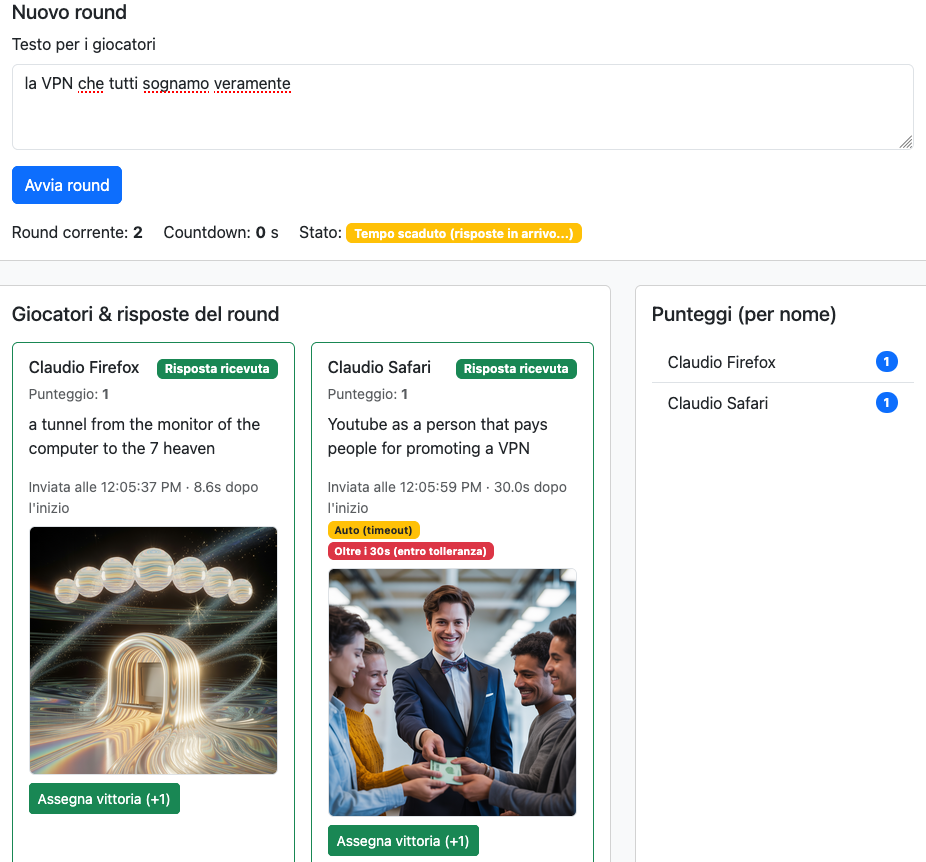
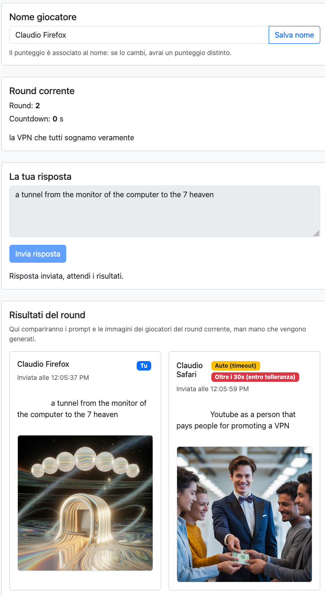
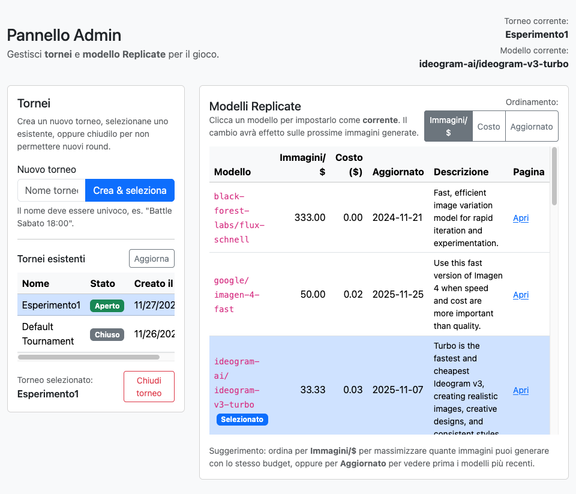
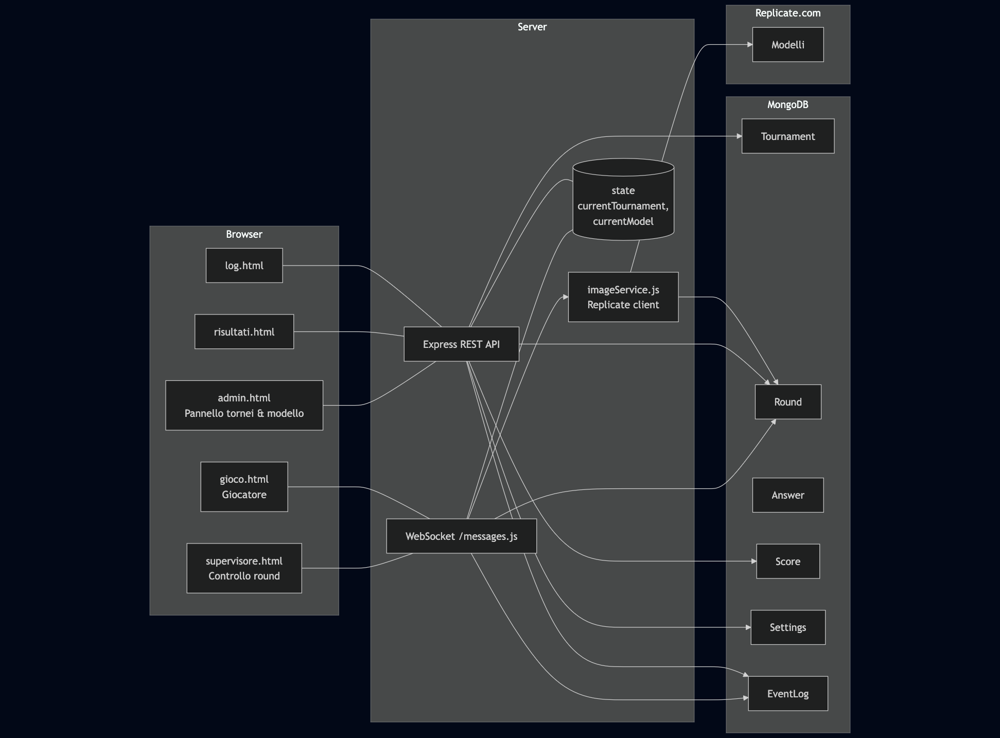
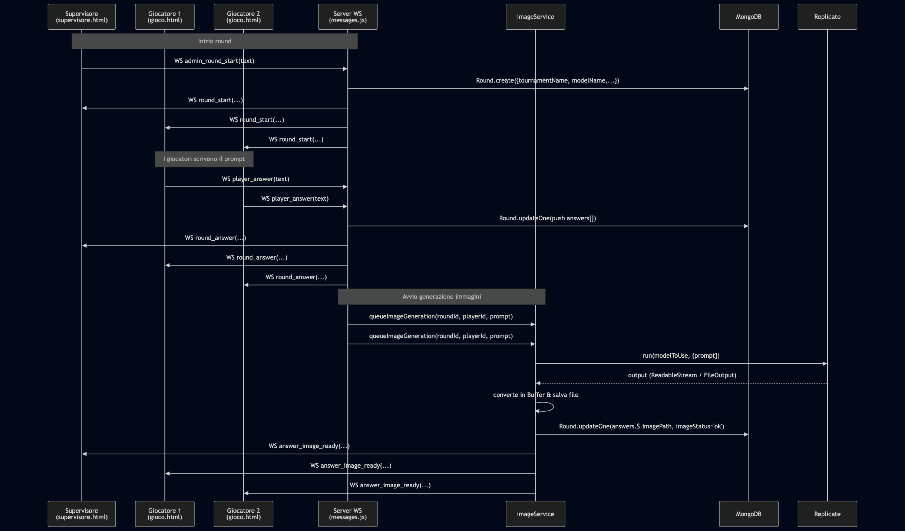
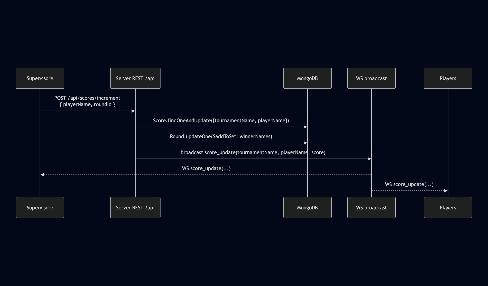

# Prompt Battle – Sfida dal concept all'immagine, passando per l'AI

Questo è un gioco in tempo reale basato su web:  
un **supervisore** propone un *task*, i **giocatori** rispondono scrivendo un prompt, e il backend genera immagini tramite modelli di GenAI (Replicate). Il supervisore assegna i punti e gestisce i **tornei**.

---

## Indice

- [Come si gioca](#come-si-gioca)
- [Schermate principali](#schermate-principali)
- [Architettura](#architettura)
- [Installazione](#installazione)
- [Configurazione (.env)](#configurazione-env)
- [Avvio](#avvio)

---

## Come si gioca

### Ruoli

- **Admin (server)**  
  Gestisce il processo sul server, Nginx, variabili di ambiente, logging.

- **Admin web**  
  Accede a `admin.html` per:
  - creare / selezionare / chiudere tornei,
  - scegliere il modello Replicate da usare globalmente.

- **Supervisore**  
  Accede a `supervisore.html` per:
  - scrivere il *task* (prompt di partenza) del round,
  - avviare il round,
  - vedere le risposte testuali e le immagini generate,
  - assegnare la vittoria (+1 punto) a uno o più giocatori.

- **Giocatori**  
  Accedono a `gioco.html` per:
  - scegliere/modificare il proprio nickname,
  - leggere il task,
  - scrivere il proprio prompt,
  - vedere le immagini generate (proprie e degli altri giocatori).

### Flusso di un round

1. **Setup torneo & modello**
   - Admin web sceglie un **torneo** (esistente o nuovo) da `admin.html`.
   - Admin web seleziona il **modello Replicate** da una tabella di modelli pre-configurati.

2. **Avvio round**
   - Il supervisore scrive un testo (task) in `supervisore.html`.
   - Premendo invio, il server:
     - crea un nuovo documento `Round` agganciato al torneo corrente,
     - invia un messaggio `round_start` via WebSocket a tutti i giocatori.

3. **Finestra di gioco**
   - I giocatori hanno **30 secondi** per scrivere il proprio prompt.
   - C’è una tolleranza di **5 secondi**: se arriva entro 35 secondi viene comunque accettato, ma segnato come *late*.
   - Se il giocatore non preme invio, allo scadere del timeout la risposta (vuota o parziale) può essere inviata automaticamente.

4. **Generazione immagini**
   - Ogni risposta (`Answer`) viene salvata in MongoDB, con:
     - `playerName`, `tournamentName`, testo, timestamp, stato, ecc.
   - In background viene chiamato Replicate (`replicate.run(...)`) con il modello corrente.
   - L’immagine risultante viene salvata in `public/pictures/<roundId>-<playerId>.png`.
   - Quando l’immagine è pronta, il server invia un evento `answer_image_ready` a:
     - supervisore,
     - tutti i giocatori.

5. **Punteggio**
   - Il supervisore, vedendo le immagini, assegna la vittoria (via API HTTP).
   - Il punteggio viene salvato nel model `Score`, **per coppia (tournamentName, playerName)**.
   - Un messaggio `score_update` viene broadcastato a tutti i client, aggiornando scoreboard e risultati.

6. **Storico & risultati**
   - `risultati.html` mostra l’elenco dei round e i vincitori di un torneo.
   - Cliccando su un round si possono vedere le immagini associate e la foto vincitrice.
   - `log.html` mostra i log grezzi degli eventi (`EventLog`), con filtri per tipo e player.

---

## Schermate principali

### Supervisore

Interfaccia usata per avviare i round, vedere le risposte e assegnare le vittorie.



---

### Giocatore (desktop)

Vista del giocatore con area testo per il prompt, stato del round e immagini risultanti.



---

### Admin – Tornei & Modelli

Pannello per creare tornei, selezionare il torneo corrente e scegliere il modello Replicate da usare.



---

## Architettura

### Componenti principali



- **Client web (frontend)**
  - `admin.html` / `js/admin.js` – gestione tornei e modello.
  - `supervisore.html` / `js/supervisore.js` – controllo round.
  - `gioco.html` / `js/gioco.js` – interfaccia giocatore.
  - `risultati.html` – lista round, immagini e vincitori.
  - `log.html` – log di sistema con filtri.

- **Server Node.js**
  - `server.js` – entrypoint, Express, WebSocket, stato globale.
  - `api.js` – REST API per tornei, settings, round, log, score.
  - `messages.js` – gestione messaggi WebSocket (`round_start`, `player_answer`, ecc.).
  - `imageService.js` – integrazione con Replicate, salvataggio immagini.
  - `utils.js` – broadcast, logging, gestione connessioni.

- **Database MongoDB**
  - `Tournament` – nome univoco, flag `isClosed`.
  - `Round` + subdocumenti `Answer`.
  - `Score` – punteggi per (tournamentName, playerName).
  - `Settings` – `currentTournamentName`, `currentModelName`.
  - `EventLog` – log di tutti i messaggi/azioni.

### Flusso di un round



### Flusso dei punteggi



---

## Installazione

### Requisiti

- **Node.js** >= 18 (meglio 20 LTS)
- **npm** (o yarn/pnpm, ma gli esempi usano npm)
- **MongoDB** in esecuzione (locale o remoto)
- **Account Replicate** e una `REPLICATE_API_TOKEN` valida
- (Opzionale) **Nginx** per reverse proxy + HTTPS in produzione

### Clone & dipendenze

```bash
git clone https://github.com/vecna/daikina
cd daikina
npm install
```

## Configurazione .env

```bash
# Porta HTTP del server Node
PORT=3000

# Connessione MongoDB
MONGODB_URI=mongodb://127.0.0.1:27017/realtime-text-game

# Token Replicate (obbligatorio per generare immagini)
REPLICATE_API_TOKEN=XXXXXXXXXXXXXXXXXXXXXXXX

# Modello di fallback (usato se non ne viene selezionato uno da admin)
REPLICATE_MODEL=black-forest-labs/flux-schnell

# Debug (usa la libreria "debug")
# Esempi:
#  DEBUG=server:*
#  DEBUG=server:ws,server:app,server:image,server:api,server:messages
DEBUG=server:*
```

## Avvio

`npm start`

Il server partirà su http://localhost:3000 (a meno che PORT sia diversa).

Accessi tipici:

* http://localhost:3000/admin.html – pannello tornei & modelli
* http://localhost:3000/supervisore.html – interfaccia supervisore
* http://localhost:3000/gioco.html – interfaccia giocatore
* http://localhost:3000/risultati.html – risultati round/torneo
* http://localhost:3000/log.html – log eventi

WebSocket endpoint: ws://<host>:<port>/ws (es. ws://localhost:3000/ws)


